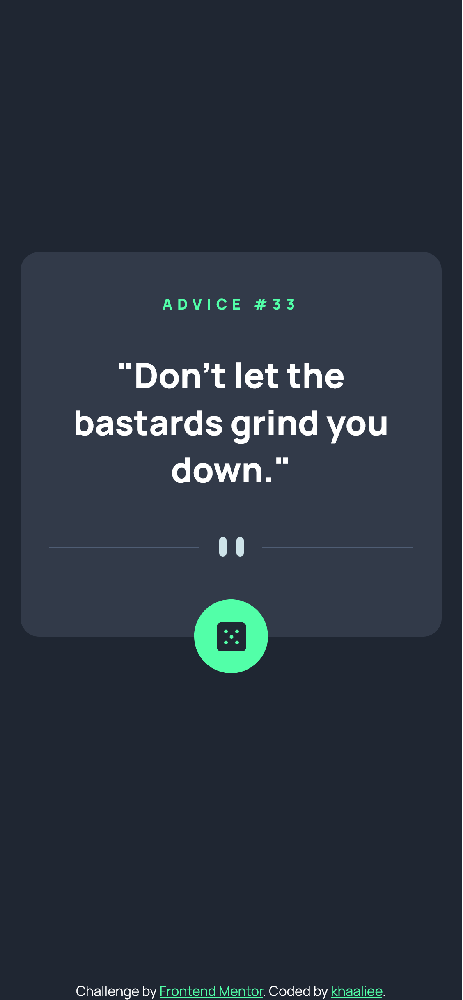
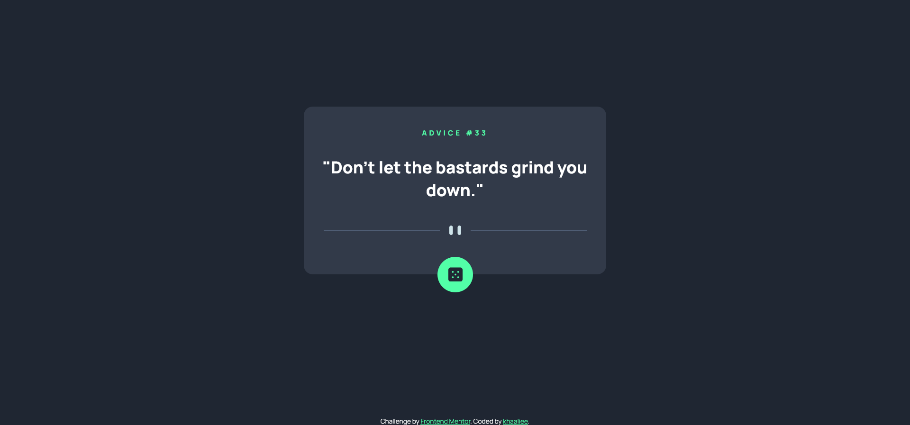

# Frontend Mentor - Advice generator app solution

This is a solution to the [Advice generator app challenge on Frontend Mentor](https://www.frontendmentor.io/challenges/advice-generator-app-QdUG-13db). Frontend Mentor challenges help you improve your coding skills by building realistic projects.

! - There is probably many mistakes, it was just fast practice.

## Table of contents

- [Overview](#overview)
  - [The challenge](#the-challenge)
  - [Screenshot](#screenshot)
  - [Links](#links)
- [My process](#my-process)
  - [Built with](#built-with)
  - [Useful resources](#useful-resources)
- [Author](#author)

## Overview

### The challenge

Users should be able to:

- View the optimal layout for the app depending on their device's screen size
- See hover states for all interactive elements on the page
- Generate a new piece of advice by clicking the dice icon

### Screenshot

### Links

- Solution URL: [Frontendmentor](https://your-solution-url.com)
- Live Site URL: [Github Pages](app-adv-generator.khaaliee.github.io)

## My process

### Built with

- Semantic HTML5 markup
- CSS custom properties
- Flexbox
- Mobile-first workflow
- API Advice (https://api.adviceslip.com/advice)

### Useful resources

- [MDN Mozilla Docs](https://developer.mozilla.org/en-US/)
- [Box Shadow Generator](https://cssgenerator.pl/box-shadow-generator/)
- [Flexbox Froggy Game](https://flexboxfroggy.com/)

## Author

- Frontend Mentor - [@khaaliee](https://www.frontendmentor.io/profile/khaaliee)
